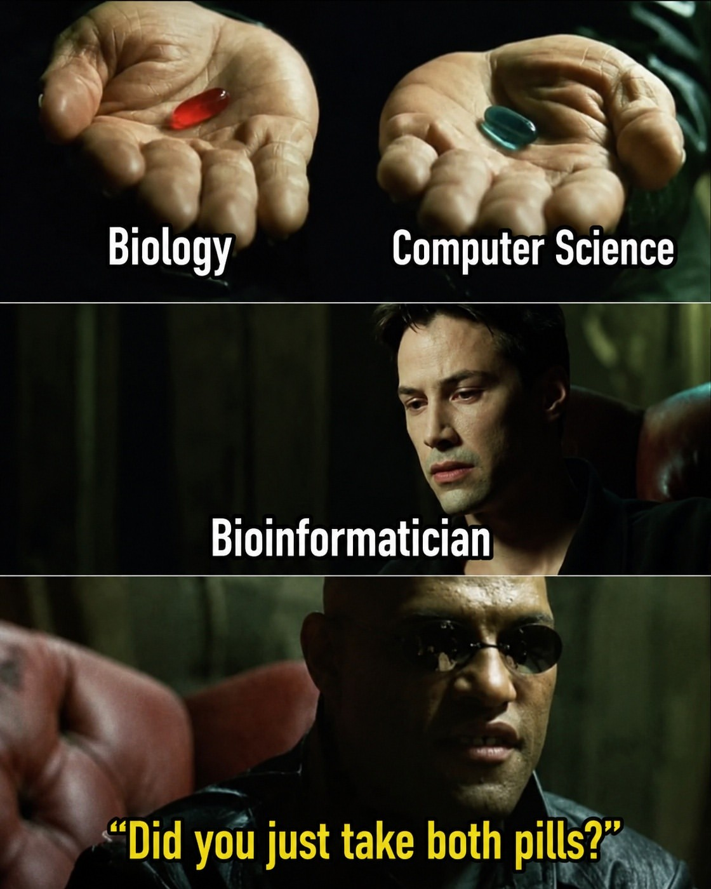
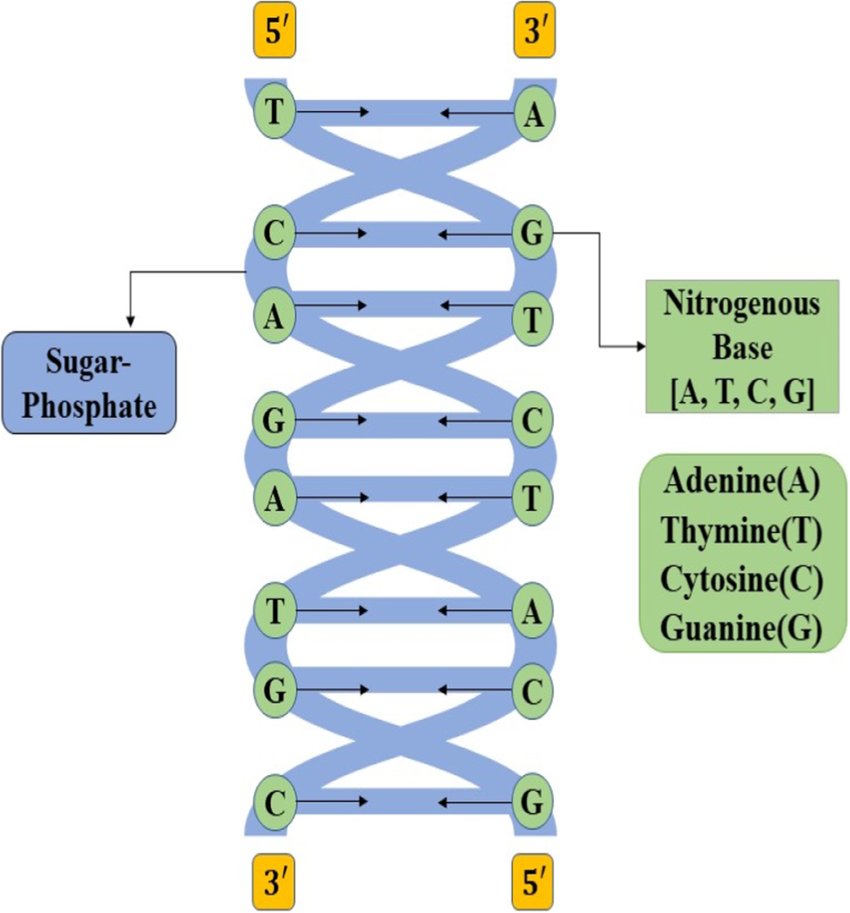

# Day 1: Key Concepts - Introduction to Bioinformatics
- Hey! I'm creating this guide with zero toxicity, just pure wish to see you win in bioinformatics. Whether you're here out of curiosity, career change, or scientific passion — you picked the right field. Buckle up, enjoy the ride, and don't hesitate to revisit sections. Learning is not linear.
- nothing relative or toxic just wish to see you win in all aspects of life.


---

## 1. What is Bioinformatics?

**Definition**: 
- Bioinformatics is an interdisciplinary field using dry lab, that is, methods and software tools for understanding biological data. Bioinformatics includes experts from computer science, statistics, even mathematics, and of course biologists for a better understanding of biological data.

**Why Important**: 
- Bioinformatics can be applied to following fields nowadays.
- Genome Sequence Data
- Gene Variation Data
- Gene Expression Data
- Single Cell Data
- Proteomic Data
- Metabolomics Data
- Epigentic Data
- Bioinformatics allows for mining public databases i.e NCBI to find genes or pathways that might be of future   intrests for research.

**Example**: 
- Find Right Cancer treatment
 When a tumor is sequenced, bioinformatician by using software tools sifts through millions of data points to identify the specific mutation driving that cancer. for example sequencing can reveal mutation(s) in a growth signalling gene that make tumor responsive to trageted drugs. 
In melanoma, a specific mutation called BRAF V600E flags patients who benefit from a different kind of therapy entirely.
there are many more like Speeding up Drug Discovery ,Protein Folding Prediction,Breeding better crops, forensics and outbreak Investigation etc.

---

## 2. Interdisciplinary Nature

**Key Components**:
- Computer Science: Using Computer knowlegde we learn how to deal with biological data computationally
- Biology: Core knowledge of biology clears the road to understand how does cellular/organismic level things work, and helps to know what does data means in life-science terms.
- Statistics: Tells us how confident we are in our data and our findings.Answers the question of significane. make in depth analysis possible
- Mathematics: It eventually helps us understand how models actually work.what they need and how they are efficient

**Synergy**: 
- Bioinformatics is essentially big data analysis for biological data sets.
-  It requires computational and statistical analyses in order to extract meaning from biological data.
-  

---

## 3. Scope of Bioinformatics

**Research Areas**:
- [ ] Genomics
- [ ] Proteomics
- [ ] Transcriptomics
- [ ] Metabolomics
- [ ] Structural Biology
- [ ] Evolutionary Biology
- [ ] Others

---

## 4. Historical Development 
Paulien Hogeweg and Ben Hesper first coined the term ‘bioinformatics’ in the early 1970s and defined it as ‘the study of informatic processes in biotic systems’¹. However, before the term was coined the stage was set for bioinformatics to emerge as a new field of study in the 1960s when computational methods were applied to protein sequence analysis by Margaret Dayhoff. In fact, Dayhoff has been referred to as ‘the mother and father of bioinformatics.

---

## 5. Current Applications

**Medical Applications**:
- [ ] Disease diagnosis
- [ ] Drug discovery
- [ ] Personalized medicine
- [ ] Gene therapy

**Research Applications**:
- [ ] Evolutionary studies
- [ ] Biodiversity analysis
- [ ] Microbiome research
- [ ] Systems biology

**Industrial Applications**:
- [ ] Biotech
- [ ] Pharma
- [ ] Agriculture
- [ ] Forensics

---

## 6. Central Dogma of Molecular Biology

**DNA → RNA → Protein**

**Bioinformatics Role**: 
- [ ] How bioinformatics helps us understand each step
- Bioinformatics deciphers the central dogma by computationally analyzing each stage of genetic information flow:

- DNA to RNA (Transcription): Algorithms scan genomes to locate genes and regulatory regions, predicting how DNA is transcribed into RNA and how transcripts are processed (e.g., splicing).
- RNA to Protein (Translation): Tools predict protein sequences from mRNA, analyze codon usage, and model protein structure and function to understand how genetic code becomes biological machinery.
- Integration & Exceptions: By integrating massive sequencing data, bioinformatics validates these models and reveals complexities like reverse transcription and the regulatory roles of non-coding RNAs
---

## 7. Big Data in Biology

**Scale of Data**:
- Human Genome: ~3.2 billion base pairs
- Genomic Databases: NCBI GenBank contains 500+ million sequences (growing 25% annually)
- NGS Output: ~100-300 gigabytes per sequencing run; globally ~1-2 exabytes annually

**Challenge**: 
- A single genome project generates data equivalent to 200+ complete books
- Manual analysis would take thousands of human-years
- Storage costs are massive; analysis requires high-performance computing
- Real-time processing is critical for clinical diagnostics

**Solution**: 
- Bioinformatics pipelines automate processing (align, annotate, visualize)
- Cloud computing (AWS, Google Cloud) handles massive datasets
- Algorithms optimized for speed (BLAST, BWA use heuristics, not brute force)
- Databases indexed for fast retrieval (NCBI's infrastructure serves 1M+ queries/day)

---

## 8. Bioinformatics Tools & Databases

**Major Databases Introduced**:
- [ ] GenBank
- [ ] UniProt
- [ ] NCBI
- [ ] Ensembl
- [ ] Others

**Tool Categories**:
- [ ] Sequence alignment
- [ ] Structure prediction
- [ ] Database search
- [ ] Visualization
- [ ] Analysis pipelines

---

## 9. Fundamental Concepts in Sequences

**DNA Basics**:
- 4 nucleotides: A, T, G, C
- A binds wth T via double Hydrogen bond
- G binds with C via tripple hydrogen bond
-The specific arrangement order of these nucleotides determines biological traits and codes for making essential body proteins
- Double helix structure
- Base pairing rules
- 

**Protein Basics**:
- 20 amino acids
- Sequence determines structure
- Structure determines function

---

## 10. Career Pathways in Bioinformatics
### **Caution:Salaries are added after searching indeed.DayDreaming is not allowed. **

### **Bioinformatician**
**Skills Required:**
- Programming: Python, R, Perl, Bash scripting
- Databases: SQL, NoSQL (MongoDB)
- Sequence analysis: BLAST, alignment algorithms
- Statistics & math (hypothesis testing, probability)
- Biology fundamentals (genetics, molecular biology)

**Typical Roles:**
- Sequence analyst (comparing DNA/proteins)
- Database curator (maintaining sequence repositories)
- Tool developer (building analysis software)
- NGS data analyst (processing sequencing experiments)

**Example Job Title:** Senior Bioinformatician at NCBI, Illumina, 23andMe

**Salary Range:** $70K-$130K USD (varies by experience & location)

**Where They Work:** 
- Research institutions (NIH, universities)
- Tech companies (Google Health, Microsoft Research)
- Biotech startups
- Diagnostic companies

---

### **Computational Biologist**
**Skills Required:**
- Advanced math & statistics (differential equations, machine learning)
- Programming: Python, C++, Julia
- Systems thinking (modeling complex biological processes)
- Biology: Cell biology, genetics, biochemistry
- Data visualization & interpretation

**Typical Roles:**
- Build mathematical models of biological systems
- Analyze gene regulatory networks
- Protein interaction prediction
- Disease pathway modeling
- Drug target discovery

**Example Job Title:** Computational Biologist at Genentech, MIT Media Lab, Stanford

**Salary Range:** $80K-$150K USD (research-focused, often PhD required)

**Where They Work:**
- Academic research labs
- Pharmaceutical R&D
- Systems biology institutes
- AI/ML companies (DeepMind, OpenAI biology)

---

### **Systems Biologist**
**Skills Required:**
- Advanced biology (biochemistry, cell biology, physiology)
- Modeling: ODE (ordinary differential equations), agent-based modeling
- Network analysis & graph theory
- Programming: MATLAB, Python, R
- Systems thinking (understand feedback loops, robustness)
- Data integration (omics: genomics, proteomics, metabolomics)

**Typical Roles:**
- Build predictive models of cellular behavior
- Analyze metabolic networks
- Study how genes interact in networks
- Design synthetic biology experiments
- Personalized medicine (patient-level predictions)

**Example Job Title:** Systems Biologist at Pfizer, Caltech, EMBL

**Salary Range:** $85K-$160K USD (PhD typical requirement)

**Where They Work:**
- Pharmaceutical companies
- Research universities
- Systems biology centers
- Synthetic biology companies

---

### **Bioinformatics Engineer / Software Engineer (Bioinformatics)**
**Skills Required:**
- Strong software engineering: Python, Java, C++, Go
- Software design & architecture
- Cloud computing: AWS, GCP, Azure
- DevOps & CI/CD pipelines
- Database design (SQL, NoSQL)
- Testing & debugging (unit tests, integration tests)
- Git, Docker, Kubernetes
- *Basic* biology understanding (enough to understand requirements)

**Typical Roles:**
- Build & maintain bioinformatics software tools
- Develop web platforms for analysis
- Optimize algorithms for speed/scale
- Design data pipelines
- Lead technical infrastructure
- Open-source bioinformatics tool development (Nextflow, Galaxy)

**Example Job Title:** Senior Software Engineer (Bioinformatics) at Ginkgo Bioworks, Recursion, 10x Genomics

**Salary Range:** $100K-$180K USD (highest-paid bioinformatics role!)

**Where They Work:**
- Biotech startups (highest growth)
- Tech companies (Google, Meta)
- Sequencing companies (Illumina, PacBio)
- Cloud platforms (AWS Health, Azure Genomics)

---

## **Quick Comparison Table**

| Career Path | Biology Level | Programming Level | Math Level | Best For |
|------------|---------------|-------------------|-----------|----------|
| Bioinformatician | ⭐⭐⭐⭐ High | ⭐⭐⭐ Intermediate | ⭐⭐⭐ Intermediate | Direct data analysis |
| Computational Biologist | ⭐⭐⭐⭐⭐ Very High | ⭐⭐⭐ Intermediate | ⭐⭐⭐⭐⭐ Advanced | Understanding systems |
| Systems Biologist | ⭐⭐⭐⭐⭐ Very High | ⭐⭐⭐ Intermediate | ⭐⭐⭐⭐ Advanced | Modeling & networks |
| Bioinformatics Engineer | ⭐⭐ Low | ⭐⭐⭐⭐⭐ Expert | ⭐⭐⭐ Intermediate | Building tools & scale |

---

## **Career Progression Paths**

### **Path 1: Researcher → Bioinformatician → Computational Biologist**
- Start: Analyze data for research questions
- Grow: Build custom analysis tools
- Mature: Design experiments based on computational predictions

### **Path 2: Software Engineer → Bioinformatics Engineer → Research Engineer**
- Start: Build bioinformatics tools
- Grow: Lead platform/infrastructure development
- Mature: Drive innovation in biotech tools

### **Path 3: Wet Lab Biologist → Bioinformatician → Systems Biologist**
- Start: Do molecular work, learn to code
- Grow: Combine wet lab + computational work
- Mature: Design experiments based on computational models

### **Path 4: Data Scientist → Bioinformatician → ML Researcher**
- Start: Apply ML to biological data
- Grow: Specialize in genomics/proteomics
- Mature: Design novel ML approaches for biology

---

## **Skills You'll Need for Course**

**Minimum to Survive:**
-  Basic Python (or willingness to learn)
-  Curiosity about biology
-  Comfort with command line (Bash)

**Nice to Have:**
- R programming (used heavily in bioinformatics)
- Linux/Unix systems knowledge
- Statistics basics
- Python 
- Script writing 

---

## **Which Path Matches YOU?**

### **Choose Bioinformatician if you:**
-  Love working directly with sequences/data
-  Want to analyze experiments
-  Enjoy scripting more than heavy math
-  Career goal: Data analyst → Senior analyst

### **Choose Computational Biologist if you:**
-  Love understanding *how* systems work
-  Enjoy deep biology + advanced math
-  Want to make predictions
-  Career goal: Research leadership, discovery

### **Choose Systems Biologist if you:**
-  Think in networks & feedback loops
-  Love integration (combining many datasets)
-  Want to model whole systems
-  Career goal: Design synthetic biology experiments

### **Choose Bioinformatics Engineer if you:**
-  Love coding & software architecture
-  Want to build tools others use
-  Prefer problem-solving over biology
-  Career goal: Lead technical teams, high salary

---

## **First Job Market (2026)**

**Hottest Roles:**
1. **Bioinformatics Engineer** - Highest demand, highest pay
2. **Bioinformatician (NGS)** - Genomics boom driving demand
3. **Computational Biologist (ML)** - AI/ML explosion in biotech

**Companies Hiring:**
- Biotech startups: Ginkgo Bioworks, Synthego, Recursion
- Big Pharma: Pfizer, Moderna, GSK
- Tech companies: Google Health, Meta, Microsoft Research
- Sequencing: Illumina, 10x Genomics, PacBio
- Diagnostics: 23andMe, MyHeritage

**Remote Work:**  Very common in bioinformatics (especially engineering roles)

---

## **What This Course Prepares You For**

After completing this course, you'll have skills for:

**Entry-Level Bioinformatician**
- Analyze sequences, run BLAST, process genomic data
- Work with public databases
- Understand NGS pipelines

 **Not Quite Ready For:**
- Systems biologist (needs advanced modeling)
- Computational biologist PhD (needs deeper math)
- Senior engineer (needs professional software skills)

 **Perfect For:**
- Getting hired for junior bioinformatics roles
- Deciding which path interests you most
- Foundation before specialization

---

##  Concept Map

```
Create a simple visual relationship between concepts:

                    Bioinformatics
                    /    |    \
              Biology  CS  Stats
                    \    |    /
                  Applications
                  /    |    \
            Medical  Research Industry
```

---

##  Pre/Post Understanding

**Before Today**: [What did you think bioinformatics was?]

**After Today**: [What do you now understand about bioinformatics?]

**Evolution of Understanding**: [How has your perspective changed?]

---

##  Concept Mastery Checklist

Rate your understanding (1=Not at all, 5=Completely):
- be generous to yourself as well.
- [ ] What bioinformatics is?
- [ ] Its interdisciplinary nature?
- [ ] Key applications?
- [ ] Major tools/databases?
- [ ] Central dogma?
- [ ] Historical context?
- [ ] Career opportunities?
- [ ] Data scales involved?
- if you are learned this far ,you're going toward new horizon.

**Areas to Review**: Any suggestions will be appreciated and helpful.
## **Conclusion**
Bioinformatics is young. Margaret Dayhoff invented it in the 1960s. Forty years later, we sequenced the human genome. Thirty years after that, we have AI predicting protein structures. You're entering a field that literally rewrites itself every few years.
**Ready to Move to Day 2**: Review once more and congratulations for Day-01 my friend.

